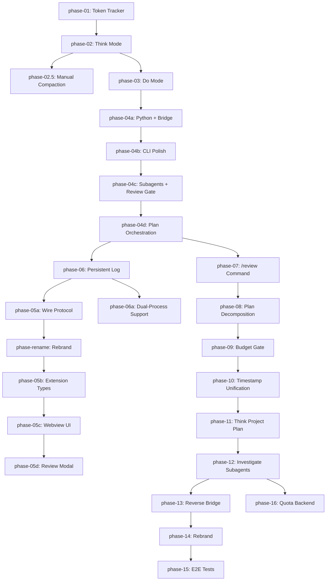

# Plan: Kimi-CLI Extensible Fork

Phased implementation of strategic features on top of the MoonshotAI/consilium upstream.

## Phase Status Table

| Phase | Title | Status | Locked |
|-------|-------|--------|--------|
| [phase-01](phase-01.md) | Token Tracker | implemented | ✅ |
| [phase-02](phase-02.md) | Think Mode | implemented | ✅ |
| [phase-02-5](phase-02-5.md) | Think Mode Manual Compaction | implemented | ✅ |
| [phase-03](phase-03.md) | Do Mode — Git Snapshotting, Change Journal & Web API | implemented | ✅ |
| [phase-04a](phase-04a.md) | Think — Python Execution & Bridge | implemented | ✅ |
| [phase-04b](phase-04b.md) | CLI Polish & Integration | implemented | ✅ |
| [phase-04c](phase-04c.md) | Think Subagents & Do Plan Review Gate | implemented | ✅ |
| [phase-04d](phase-04d.md) | Plan-Driven Think/Do Orchestration & External Memory | implemented | ✅ |
| [phase-06](phase-06.md) | Persistent Log Architecture | implemented | ✅ |
| [phase-05](phase-05.md) | VS Code: Extension — Overview | staged | ❌ |
| [phase-05a](phase-05a.md) | Wire Protocol Extensions (CLI) | implemented | ✅ |
| [phase-rename](phase-rename.md) | Rebrand to Consilium | implemented | ✅ |
| phase-05b | Extension Shared Types + Handlers | pending | ❌ |
| phase-05c | Webview UI Enhancements | pending | ❌ |
| phase-05d | Review Report Modal + Commands | pending | ❌ |
| [phase-07](phase-07.md) | `/review` Slash Command in Do Mode | implemented | ✅ |
| [phase-08](phase-08.md) | Plan Decomposition (Per-Documents + Index) | implemented | ✅ |
| [phase-09](phase-09.md) | Budget Gate (Subagent Limits) | implemented | ✅ |
| [phase-10](phase-10.md) | Timestamp Format Unification | implemented | ✅ |
| [phase-11](phase-11.md) | Think Project Plan Command + Plan-Centric Handoff | implemented | ✅ |
| [phase-06a](phase-06a.md) | Dual-Process Support (Think + Do over Wire) | implemented | ✅ |
| [phase-06b](phase-06b.md) | Session Pairing for Dual-Process | implemented | ✅ |
| [phase-12](phase-12.md) | `/investigate` — Parallel Background Subagents | implemented | ✅ |
| [phase-13](phase-13.md) | Reverse Bridge (`/push-to-think`) | implemented | ✅ |
| [phase-14](phase-14.md) | Rebrand to Consilium | planned | ❌ |
| [phase-15](phase-15.md) | E2E Testing Infrastructure | planned | ❌ |
| [phase-16](phase-16.md) | Platform Quota Backend | implemented | ✅ |

## Dependency Graph

## Decisions

| ADR | Title | Status | Date |
|-----|-------|--------|------|
| 001 | Decomposed plan format over monolithic | accepted | 2026-05-24 |
| 002 | Unix float timestamps over ISO 8601 strings | accepted | 2026-05-29 |
| 003 | Plan-centric handoff over conversation outbox | accepted | 2026-05-29 |

## Findings

| Finding | Title | Related Phases |
|---------|-------|----------------|
| 001 | Token tracking can be done via kosong StepResult | phase-01 |
| 002 | Think/Do dichotomy requires explicit handoff, not auto-merge | phase-04a, phase-11 |

## Notes

- **Deferred Features** section from the monolithic plan is not a phase; it lives below.
- **Open Questions** are tracked at the bottom of this index and should be reviewed before starting any pending phase.

---

## Deferred Features

The following deferred features have been consolidated into new phases (see phase table above). This section is retained for historical context.

### Reverse Bridge (`/push-to-think`)

→ **Phase 13** — Bidirectional Think/Do handoff. Opt-in via `auto_push_to_think = false` default.

### `/investigate` — Parallel Background Subagents

→ **Phase 12** — Implemented. Wire events (12.3) and extension integration (12.5) remain as future enhancements.

### E2E Integration Test

→ **Phase 15** — Mock LLM + Ollama providers, full pipeline test.

### Budget Display in Dollars

→ **Phase 16** — Local token quota implemented; dollar conversion remains low priority.

### Consilium Platform Quota Overlay

→ **Phase 16** — Backend endpoint for extension quota overlay. Platform API integration optional.

### Rename to Consilium

→ **Phase 14** — Full mechanical rebrand. Deferred until all functional work complete (now ready).

---

## Updated Open Questions for Future Resolution

1. **Pre-edit baseline capture:** RESOLVED in Phase 3.

2. **Binary files:** RESOLVED in Phase 4b.

3. **Journal retention:** RESOLVED in Phase 4b.

4. **Concurrent sessions:** If multiple Do sessions run concurrently, their git stashes may conflict. This is unlikely for a single-user CLI but worth documenting.

5. **Think Python sandbox on Windows:** `sandboxed` level falls back to `restricted` on non-macOS. A Windows-specific sandbox (Job Object, AppContainer) could be added later.

6. **Do mode resumption after push:** RESOLVED in Phase 11. Think `/push-to-do` writes a dispatch signal; Do does NOT auto-execute. The user must explicitly run `kimi --do --plan-file plan/index.md --phase {id}`. This is by design — the plan is the handoff artifact, not conversation history.

7. **Plan decomposition migration:** RESOLVED in Phase 8 (`/split-plan`) and Phase 11 (`/plan init`). Monolithic plans can be split interactively, and new plans are created directly in decomposed format. Migration guide: run `/split-plan` on any existing `plan.md`, then `/plan init` for new projects.

8. **Budget gate scope expansion:** Should budget limits also apply to the main agent loop (not just subagents)? User specifically requested subagent-only for now, but this could be expanded later.

9. **Reverse bridge UX:** RESOLVED — Phase 13 design: opt-in via `auto_push_to_think = false` default. No prompt; reports go to inbox, `/inbox` command to view.

10. **Investigate task result format:** RESOLVED — Phase 12 implemented. Results are returned as a unified markdown report (simple concatenation). Format can be iterated later.

11. **Plan synthesis quality:** LLM-generated plans may be incomplete or have incorrect dependencies. Should we add a `/plan review` subcommand (distinct from Do-mode audit) where Think mode validates the synthesized plan before `/push-to-do`? Consider adding this to Phase 11 or as a Phase 11.5 enhancement.

12. **Dispatch file format:** Phase 11 specifies `~/.consilium/dispatch.json` as the handoff mechanism. Should this use a more structured format (e.g., SQLite table or a queue directory) to support multiple pending dispatches? For now, single-file dispatch is sufficient; scale later if needed.

13. **ADR versioning:** ADRs have `supersedes`/`superseded_by` fields. Should `/plan update` automatically chain ADRs when a decision changes, or is manual creation sufficient? Manual is simpler; automation can be added later.

14. **Plan index auto-sync:** Should the `PlanDirectory` model cache its in-memory state, or always re-read from disk? Phase 11 assumes re-read on every access for simplicity, but a cache with invalidation may be needed if the CLI grows a GUI.

15. **Outbox deprecation timeline:** Phase 11 deprecates `think_outbox/` but keeps it for backward compat. When is it safe to remove? Proposed: Phase 14 rebrand (after two full releases of deprecation warnings).