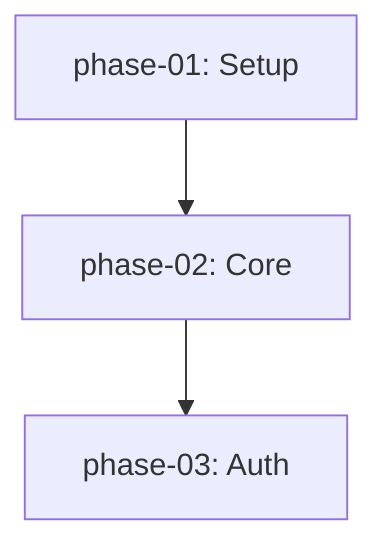
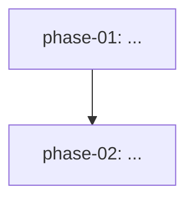

**Status: IMPLEMENTED — 1035 tests passing (41 new + 994 previous).**

**Implementation report:** `plan/reports/phase-11-report.md`
**Review:** `plan/reports/phase-11-review.md`

**Blockers review:** `scratch/reports/phase_11_blockers_review.md`

**Decision driver:** User identified that Think mode needs strategic project planning (distinct from upstream tactical plan mode). Also identified that `/push-to-do` should hand off the PLAN document, not conversation history.

### Problem

**Upstream plan mode** (`--plan` flag) is tactical: "What do I do in this session?" It writes a single `~/.consilium/plans/{slug}.md` and discards it after execution.

**Think mode needs strategic planning:** "What's the architecture and phased roadmap for this project?" The plan lives in the project repo (`plan/`), is edited across sessions, and guides Do mode implementation.

**Current handoff is wrong:** `/push-to-do` exports Think conversation messages to an outbox JSON. Do mode seeds its context from this conversation history. But Do doesn't need reasoning trails — it needs structured execution instructions.

**The plan document already contains:**
- Phases with descriptions, dependencies, acceptance criteria
- Decisions (via `related_decisions` frontmatter)
- Findings (via `related_findings` frontmatter)
- (Once timestamps are added) When things were decided

**Why push conversation history when the plan IS the handoff artifact?**

### Architectural decision: Plan-centric handoff

| Before (current) | After (Phase 11) |
|---|---|
| `/push-to-do` → writes conversation outbox JSON | `/push-to-do` → writes `dispatch.json` pointing to plan + phase |
| Do loads conversation messages as context | Do loads plan document as context |
| Think outbox (`~/.consilium/think_outbox/`) | Think outbox **deprecated** — removed in Phase 12 |
| `--seed-from-think {session_id}` | `--seed-from-think` **deprecated** — use `--plan-file` + `--phase` |

**New handoff flow:**
```
Think mode:
  /plan init → creates plan/index.md + phase files
  ... (research, refine)
  /push-to-do → writes ~/.consilium/dispatch.json
                  { plan_file: "plan/index.md",
                    target_phase: "phase-02",
                    action: "start_implement" }

Do mode:
  kimi --do --plan-file plan/index.md --phase phase-02
  → loads plan directly (no conversation history)
  → plan review gate audits phase-02
  → implements phase-02
  → writes plan/reports/completion-phase-02.md
  → updates plan/index.md: phase-02 status = implemented, locked = true
```

### Solution

#### 11.1 Default project docs layout

When `/plan init` runs, it scaffolds this structure in the project root:

```
docs/                      # Human-facing documentation (tracked)
├── AGENTS.md              # Agent guidance
├── BEST_PRACTICES.md      # Coding conventions
└── README.md              # Project overview

plan/                      # Operational plan documents (tracked)
├── index.md               # Plan overview, status table, dependency graph
├── phase-*.md             # Per-phase documents
├── decisions/
│   ├── index.md           # ADR master index
│   └── 001-*.md           # Individual ADRs
├── findings/              # Research outputs from Think mode
│   └── 001-*.md
└── reports/               # Do mode outputs (auto-generated, gitignored)
    ├── audit-phase-*.md
    └── completion-phase-*.md
```

**Rationale:** `docs/` is reserved for human-readable project documentation (manuals, guides, conventions). `plan/` contains machine-parseable operational data — Do mode reads `plan/index.md` at runtime, Think mode synthesizes phases into it, and slash commands mutate it. Keeping them separate prevents confusion between "docs you read" and "docs the CLI executes."

#### 11.2 Plan `index.md` format (formalized)

```markdown
---
plan_id: my-project
created: 2026-05-29
last_updated: 2026-05-29
current_phase: phase-02
overall_status: 1 / 3 implemented
---

# Plan: My Project

## Phase Status Table

| Phase | Title | Status | Locked | Last Updated |
|-------|-------|--------|--------|--------------|
| [phase-01](phase-01.md) | Setup | implemented | ✅ | 2026-05-29 |
| [phase-02](phase-02.md) | Core Engine | under_review | ❌ | 2026-05-29 |
| [phase-03](phase-03.md) | Auth | pending | ❌ | — |

## Dependency Graph



## Decisions

| ADR | Title | Status | Date |
|-----|-------|--------|------|
| [001](../decisions/001-use-postgresql.md) | Use PostgreSQL | accepted | 2026-05-29 |
```

The status table and decisions table are **machine-parseable** (Markdown tables), not freeform text. This enables `plan status` commands and UI rendering.

#### 11.3 Phase frontmatter extensions

```yaml
---
phase_id: phase-03
title: Authentication
status: pending
dependencies:
  - phase-01
files_involved:
  - src/auth/oauth2.py
related_findings:
  - findings/001-auth-comparison
related_decisions:
  - decisions/001-use-postgresql
---
```

`related_findings` and `related_decisions` create bidirectional traceability between phases, research, and architecture decisions.

#### 11.4 ADR format (`plan/decisions/001-*.md`)

```markdown
---
adr_id: 001
title: Use PostgreSQL over SQLite
status: accepted
date: 2026-05-29
supersedes: null
superseded_by: null
---

# ADR 001: Use PostgreSQL over SQLite

## Context
SQLite is simpler but doesn't handle concurrent writes well.

## Decision
Use PostgreSQL for all persistent storage.

## Consequences
- Need Docker Compose for local dev
- Better concurrency support
- More complex backups
```

`plan/decisions/index.md` is a master index with status table, similar to `plan/index.md`.

#### 11.5 Finding format (`plan/findings/001-*.md`)

```markdown
---
finding_id: 001
title: Auth Methods Comparison
date: 2026-05-29
related_phases:
  - phase-03
---

# Finding 001: Auth Methods Comparison

## Summary
JWT+JWE is required, not plain JWT.

## Evidence
- [RFC 7516](https://tools.ietf.org/html/rfc7516) — JSON Web Encryption
- Source: src/auth/research.md

## Impact
Affects Phase 3 encryption strategy.
```

#### 11.6 Think `/plan` command suite

```python
@think_registry.command(name="plan")
async def slash_plan(history, session, args):
    """Project plan management.
    
    /plan init [name]              # LLM synthesizes plan from conversation
    /plan status                   # Show plan + decisions + findings status
    /plan add-phase <title>        # Add empty phase, LLM fills from context
    /plan update <phase-id>        # Re-synthesize phase from conversation
    /plan add-decision <title>     # Create ADR from conversation
    /plan add-finding <title>      # Create finding from conversation
    """
```

**`/plan init`** — the key command:
1. Check if `plan/index.md` already exists → confirm overwrite
2. Format synthesis prompt from Think conversation history
3. Call ThinkSoul's own LLM (`_call_llm()` or `generate()`)
4. LLM outputs file blocks with `=== FILE: path ===` delimiters
5. Parse blocks, write files to `plan/`, `plan/decisions/`, `plan/findings/`
6. Update `docs/README.md` to include plan index link
7. Validate by re-parsing with `parse_plan_directory_from_path()`

**LLM prompt for synthesis:**
```markdown
You are a project planner. Based on the conversation below, synthesize a
phased implementation plan with architecture decisions and findings.

Conversation:
{{think_conversation}}

Output format:
Write the plan as decomposed markdown files using this delimiter format:

=== FILE: plan/index.md ===
---
plan_id: ...
---
...

=== FILE: plan/phase-01.md ===
---
title: ...
status: pending
---
...

Also create any necessary decisions in plan/decisions/ and findings in plan/findings/.
```

**Why Markdown delimiters, not JSON:**
- LLMs are trained extensively on Markdown; JSON output is unreliable
- The output IS the file content — no secondary rendering needed
- Kosong does not support `response_format` / JSON mode
- Parsing is simple regex: `r"=== FILE: (.+?) ===\n(.*?)\n(?=== FILE: |$)"`

**Error recovery:**
If parsing fails or validation finds errors, show the user the raw LLM output and ask them to fix it, or retry with a more constrained prompt.

#### 11.7 Plan-centric `/push-to-do` rework

**Current behavior (to be deprecated):**
```python
# think/push.py
export_to_outbox(session) → ~/.consilium/think_outbox/{session_id}.json
```

**New behavior:**
```python
# think/push.py (rewritten)
def push_plan_to_do(plan_file: Path, target_phase: str) -> Dispatch:
    """Write a dispatch signal pointing to the plan document."""
    if not plan_file.exists():
        raise RuntimeError(f"No plan found at {plan_file}. Use /plan init first.")
    
    return write_dispatch(
        plan_id=parse_plan_file(plan_file).metadata.plan_id,
        target_phase=target_phase,
        action=DispatchAction.START_IMPLEMENT,
    )
```

**Think slash command:**
```python
@think_registry.command(name="push-to-do")
def slash_push_to_do(history, session, args):
    plan_file = Path("plan/index.md")
    if not plan_file.exists():
        return "No plan found. Use /plan init first."
    
    target_phase = args.strip() or _infer_next_phase(plan_file)
    dispatch = push_plan_to_do(plan_file, target_phase)
    return (
        f"Dispatched plan to Do mode.\n"
        f"Target phase: {target_phase}\n"
        f"Run: kimi --do --plan-file {plan_file} --phase {target_phase}"
    )
```

**Do mode loading:**
```python
# app.py (simplified)
if seed_from_think:
    # DEPRECATED: load outbox messages
    logger.warning("--seed-from-think is deprecated. Use --plan-file instead.")
    # ... existing outbox loading (remove in Phase 12)

# Primary path: load plan directly
if plan_file:
    do_session = DoSession(..., plan_file=plan_file, phase=phase)
```

#### 11.8 Do mode auto-updates plan index on completion

When Do finishes implementing a phase:
1. Write `plan/reports/audit-{phase_id}.md` (if audit was performed)
2. Write `plan/reports/completion-{phase_id}.md`
3. Update `plan/index.md`:
   - Set phase status to `implemented`
   - Set `locked: true`
   - Update `last_updated`
   - Update `current_phase` to next pending phase
   - Update `overall_status`

This keeps the plan index as the single source of truth for project status.

### Implementation

#### 11.1 Think command module

Create `src/consilium/think/plan_commands.py`:
- `slash_plan_init()` — plan synthesis
- `slash_plan_status()` — parse and display plan status
- `slash_plan_add_phase()` — add phase
- `slash_plan_update()` — update phase
- `slash_plan_add_decision()` — create ADR
- `slash_plan_add_finding()` — create finding

#### 11.2 Plan synthesis parser

Create `src/consilium/think/plan_synthesis.py`:
- `synthesize_plan_from_conversation(messages) -> str` — formats LLM prompt
- `parse_file_delimiters(text) -> dict[str, str]` — parses `=== FILE: ===` blocks
- `write_plan_files(files: dict, work_dir: Path)` — writes to disk

#### 11.3 ADR and finding templates

Create `src/consilium/plan/adr.py` and `src/consilium/plan/finding.py`:
- `render_adr()` / `render_finding()` — Markdown templates
- `parse_adr()` / `parse_finding()` — for validation and indexing

#### 11.4 Update `think/push.py`

Replace outbox-based export with plan-dispatch:
- `push_plan_to_do(plan_file, target_phase) -> Dispatch`
- Deprecate `export_to_outbox()` (keep for backward compat, log warning)

#### 11.5 Update `app.py`

- Add deprecation warning for `--seed-from-think`
- Ensure `--plan-file` + `--phase` is the primary path

#### 11.6 Update `do/session.py`

- Add plan index auto-update after phase completion
- Write completion reports to `plan/reports/`

#### 11.7 Add `/complete` slash command (Do mode)

**Blocker 1 resolution:** Do mode needs an explicit "finish implementing" signal. Users exit via `/exit` or Ctrl+C; there is no implicit completion detection.

**`src/consilium/soul/slash.py` (Do-mode slash commands):**
```python
@registry.command
async def complete(soul: KimiSoul, args: str):
    """Mark the current phase as complete.
    
    Writes a completion report and updates the plan index.
    Usage: /complete [notes]
    """
    from consilium.do.session import DoSession
    
    # DC-1: Mode guard — /complete is Do-mode only
    # Check if this soul has an associated DoSession
    do_session = _find_do_session_for_soul(soul)
    if do_session is None:
        wire_send(TextPart(text="/complete only works in Do mode."))
        return
    
    if do_session._phase is None:
        wire_send(TextPart(text="No target phase set. Run with --phase."))
        return
    
    phase_id = do_session._phase
    plan_file = do_session._plan_file
    notes = args.strip()
    work_dir = do_session.work_dir  # DC-2: use DoSession's public attr, not soul._runtime
    
    # 1. Write completion report
    report_path = _write_completion_report(plan_file, phase_id, work_dir, notes)
    
    # 2. Update plan index (CI-2: parse → mutate → re-render)
    _update_plan_index_status(plan_file, phase_id, status="implemented", locked=True)
    
    # 3. Store signal in journal
    if do_session.journal is not None:
        do_session.journal.append({
            "type": "phase_complete",
            "phase_id": phase_id,
            "report_path": str(report_path),
            "timestamp": time.time(),
        })
    
    wire_send(TextPart(
        text=f"Phase {phase_id} marked complete.\n"
             f"Report: {report_path}\n"
             f"Plan index updated."
    ))


def _find_do_session_for_soul(soul: KimiSoul) -> DoSession | None:
    """CI-1: Iterate the DoSession registry instead of using id(soul)."""
    from consilium.do.registry import _DO_SESSIONS
    for do_session in _DO_SESSIONS.values():
        if do_session.soul is soul:
            return do_session
    return None


def _write_completion_report(
    plan_file: Path | None,
    phase_id: str,
    work_dir: Path,
    notes: str,
) -> Path:
    """CI-3: Use unified timestamps (Phase 10), not datetime.now()."""
    from consilium.utils.timestamp import format_iso
    
    reports_dir = work_dir / "plan" / "reports"
    reports_dir.mkdir(parents=True, exist_ok=True)
    
    report_path = reports_dir / f"completion-{phase_id}.md"
    
    # Gather journal summary
    changes_summary = "(journal not available)"
    # ... extract from ChangeJournal if attached
    
    content = f"""---
phase_id: {phase_id}
completed_at: {format_iso(time.time())}
---

# Completion Report: {phase_id}

## Summary
{notes or "(no notes provided)"}

## Changes
{changes_summary}

## Verification
- [ ] Acceptance criteria met
- [ ] Tests pass
- [ ] Code reviewed
"""
    report_path.write_text(content, encoding="utf-8")
    return report_path


def _update_plan_index_status(
    plan_file: Path | None,
    phase_id: str,
    status: str,
    locked: bool,
) -> None:
    """CI-2: Parse → mutate → re-render using PlanDirectory model.
    
    Do NOT use regex on Markdown tables. Load the index into a
    PlanDirectory, update the phase object, then re-render.
    """
    if plan_file is None:
        return
    index_file = plan_file if plan_file.name == "index.md" else plan_file.parent / "index.md"
    if not index_file.exists():
        return
    
    from consilium.plan.parser import parse_plan_directory_from_path
    from consilium.plan.models import PlanDirectory
    
    plan_dir = parse_plan_directory_from_path(index_file)
    phase = plan_dir.get_phase(phase_id)
    if phase is None:
        return
    
    phase.status = status  # type: ignore
    phase.locked = locked  # type: ignore
    # Re-render index.md from model
    rendered = _render_plan_index(plan_dir)
    index_file.write_text(rendered, encoding="utf-8")


def _render_plan_index(plan_dir: PlanDirectory) -> str:
    """Render PlanDirectory back to index.md Markdown."""
    lines = ["---"]
    lines.append(f"plan_id: {plan_dir.metadata.plan_id}")
    from consilium.utils.timestamp import format_date
    lines.append(f"last_updated: {format_date(time.time())}")
    lines.append("---")
    lines.append("")
    lines.append(f"# Plan: {plan_dir.metadata.plan_id or 'Untitled'}")
    lines.append("")
    lines.append("## Phase Status Table")
    lines.append("")
    lines.append("| Phase | Title | Status | Locked |")
    lines.append("|-------|-------|--------|--------|")
    for phase in plan_dir.phases:
        lock_icon = "✅" if phase.locked else "❌"
        lines.append(f"| [{phase.phase_id}]({phase.phase_id}.md) | {phase.title} | {phase.status} | {lock_icon} |")
    # ... (dependency graph, decisions table, etc.)
    return "\n".join(lines) + "\n"
```

**Registration:** Add `complete` to the Do-mode slash command registry. If Do mode uses a separate registry from Think mode, register there instead.

**Edge cases:**
- `/complete` in Think mode → error message
- `/complete` with no `--phase` → error message  
- Plan file not found → write report locally, skip index update

#### 11.8 Update `Dispatch` model

**Blocker 2 resolution:** `Dispatch` needs a `plan_file` field. Do mode cannot resolve a plan from `plan_id` alone without scanning the filesystem.

**`src/consilium/plan/models.py`:**
```python
class Dispatch(BaseModel):
    dispatch_id: str
    plan_id: str
    plan_file: str | None = None   # ← NEW: absolute or relative path to plan index
    action: DispatchAction
    target_phase: str
    dispatched_at: float = Field(default_factory=lambda: __import__("time").time())
    dispatched_by: Literal["think", "user", "afk_auto"] = "think"
    require_user_approval: bool = True
    afk_mode: bool = False
```

**`src/consilium/plan/dispatch.py`:**
```python
def write_dispatch(
    plan_id: str,
    target_phase: str,
    plan_file: str | None = None,   # ← NEW
    action: DispatchAction = None,
    ...
) -> Dispatch:
    dispatch = Dispatch(
        dispatch_id=f"disp_{time.time():.0f}_{uuid.uuid4().hex[:6]}",
        plan_id=plan_id,
        plan_file=plan_file,        # ← NEW
        ...
    )
    ...

def read_dispatch(path: Path | None = None) -> Dispatch | None:
    ...
    try:
        data = json.loads(path.read_text(encoding="utf-8"))
        dispatch = Dispatch.model_validate(data)
        if dispatch.plan_file and not Path(dispatch.plan_file).exists():
            raise FileNotFoundError(f"Plan file not found: {dispatch.plan_file}")
        return dispatch
    except (json.JSONDecodeError, Exception):
        ...
```

**Do mode loading (`app.py`):**
```python
if seed_from_think:
    logger.warning("--seed-from-think is deprecated. Use --plan-file instead.")
    # ... existing fallback loading

# Primary path: load from dispatch or explicit args
plan_file = plan_file or (dispatch.plan_file if dispatch else None)
```

#### 11.9 Incremental plan synthesis

**Blocker 3 resolution:** Use incremental generation with sequential phase synthesis. Max 20 phases per `/plan init`.

**Decision rationale:**
- Approach B (incremental) selected over single-shot and hybrid
- Max 20 phases — generous cap, excess phases go into a "deferred" section of the index
- Sequential synthesis — simpler debugging, predictable token usage, no subagent budget complications

**Algorithm:**

```python
MAX_PHASES_PER_INIT = 10  # MVP cap; increase to 20 after validation
MAX_RETRIES = 2

async def synthesize_plan_incrementally(
    messages: list[ThinkMessage],
    llm: LLMProvider,
) -> dict[str, str]:
    """Returns {filepath: content} for all plan files.
    
    DC-3: Compacts conversation history before synthesis to reduce token cost.
    Up to 10 phases = 1 index call + 10 phase calls = 11 LLM calls max.
    """
    files: dict[str, str] = {}
    
    # DC-3: Compact conversation to summary before synthesis
    summary = await _summarize_for_planning(messages)
    
    # Step 1: Synthesize index
    index_prompt = _format_index_prompt(summary)
    index_content = await _generate_and_validate(
        llm, index_prompt, expected_path="plan/index.md"
    )
    files["plan/index.md"] = index_content
    
    # Step 2: Parse phase list from index frontmatter/status table
    phase_ids = _extract_phase_ids(index_content)
    
    if len(phase_ids) > MAX_PHASES_PER_INIT:
        logger.warning(
            f"Conversation suggests {len(phase_ids)} phases; "
            f"capping at {MAX_PHASES_PER_INIT}. Remainder goes to deferred section."
        )
        phase_ids = phase_ids[:MAX_PHASES_PER_INIT]
        files["plan/index.md"] = _append_deferred_section(index_content, phase_ids)
    
    # Step 3: Synthesize each phase sequentially
    for phase_id in phase_ids:
        phase_prompt = _format_phase_prompt(summary, index_content, phase_id)
        phase_content = await _generate_and_validate(
            llm, phase_prompt, expected_path=f"plan/{phase_id}.md"
        )
        files[f"plan/{phase_id}.md"] = phase_content
    
    return files


async def _summarize_for_planning(messages: list[ThinkMessage]) -> str:
    """DC-3: Summarize conversation into planning-relevant context.
    Reduces token cost from full history to ~1-2K tokens."""
    # Reuse think compaction or a dedicated summary prompt
    ...


async def _generate_and_validate(
    llm: LLMProvider,
    prompt: str,
    expected_path: str,
) -> str:
    """CI-5: Use chat-based LLM interface, not completion-based.
    
    Kosong is chat-based. Format prompt as system+user messages.
    """
    from kosong import Message as KosongMessage
    
    for attempt in range(MAX_RETRIES + 1):
        # CI-5: chat_provider.chat() not llm.generate()
        response = await llm.chat_provider.chat([
            KosongMessage.system(
                "You are a project planner. Output only the requested file using === FILE: delimiters."
            ),
            KosongMessage.user(prompt),
        ])
        raw = response.content  # or extract text from response
        
        try:
            content = _extract_file_block(raw, expected_path)
            _validate_file(content, expected_path)
            return content
        except SynthesisError as e:
            # G5: Error handling for exhausted retries
            if attempt < MAX_RETRIES:
                prompt = _strengthen_prompt(prompt, expected_path, str(e))
            else:
                raise SynthesisError(
                    f"Failed to synthesize {expected_path} after {MAX_RETRIES} retries. "
                    f"Last error: {e}. "
                    f"Try /plan init with a shorter conversation or clearer requirements."
                )
    raise RuntimeError("Unreachable")


def _validate_file(content: str, expected_path: str) -> None:
    """Validate extracted file content before writing."""
    # CI-7: Path traversal check using Path.is_relative_to(), not string prefix
    allowed_root = Path("plan").resolve()
    resolved = allowed_root / expected_path
    try:
        if not resolved.resolve().is_relative_to(allowed_root):
            raise SynthesisError(f"Path traversal detected: {expected_path}")
    except ValueError:  # is_relative_to raises ValueError on Windows for different drives
        raise SynthesisError(f"Invalid path: {expected_path}")
    
    # Rule 2: YAML frontmatter must parse
    frontmatter, _ = _split_frontmatter(content)
    if frontmatter:
        try:
            yaml.safe_load(frontmatter)
        except yaml.YAMLError as e:
            raise SynthesisError(f"Invalid YAML frontmatter: {e}")
    
    # Rule 3: For index.md, must have a phase status table
    if expected_path.endswith("index.md"):
        if "| Phase |" not in content and "## Phase" not in content:
            raise SynthesisError("index.md missing phase list or status table")


def _extract_file_block(text: str, expected_path: str) -> str:
    """Extract content for expected_path from === FILE: delimiters."""
    pattern = rf"=== FILE: {re.escape(expected_path)} ===\n(.*?)\n(?=== FILE: |\Z)"
    match = re.search(pattern, text, re.DOTALL)
    if match:
        return match.group(1).strip()
    
    # Fallback: if no delimiters, assume the entire output is the file
    if "=== FILE:" not in text:
        return text.strip()
    
    # Fallback: if delimiters exist but wrong path, search for any matching path
    alt_pattern = r"=== FILE: (plan/[^\s]+) ===\n(.*?)\n(?=== FILE: |\Z)"
    for path, content in re.findall(alt_pattern, text, re.DOTALL):
        if path == expected_path or path.endswith(Path(expected_path).name):
            return content.strip()
    
    raise SynthesisError(f"Could not find file block for {expected_path}")


def _strengthen_prompt(original: str, expected_path: str, error: str) -> str:
    """Add stronger instructions to the prompt after a failure."""
    return f"""{original}

IMPORTANT: Your previous attempt failed validation: {error}
Please strictly follow this format:

=== FILE: {expected_path} ===
---
frontmatter: here
---
content here

Do not add any other text outside the === FILE: block.
"""
```

**Prompt structure for index synthesis:**
```markdown
You are a project planner. Based on the conversation below, synthesize a
phased implementation plan.

Conversation:
{{formatted_messages}}

Output ONLY the plan index file using this exact format:

=== FILE: plan/index.md ===
---
plan_id: ...
created: YYYY-MM-DD
---

# Plan: ...

## Phase Status Table
| Phase | Title | Status | Locked |
|-------|-------|--------|--------|
| phase-01 | ... | pending | ❌ |
...

## Dependency Graph


Guidelines:
- Use at most 20 phases. If more are needed, list the first 20 and add a "Deferred" section.
- Every phase must have a unique phase_id matching pattern phase-NN
- Status is always "pending" for new plans
- Dependencies must reference existing phase_ids in this plan
```

**Prompt structure for phase synthesis:**
```markdown
You are a project planner. Based on the conversation and the plan index below,
synthesize the detailed specification for one phase.

Plan index:
{{index_content}}

Target phase: {{phase_id}}

Output ONLY the phase file using this exact format:

=== FILE: plan/{{phase_id}}.md ===
---
phase_id: {{phase_id}}
title: ...
status: pending
dependencies:
  - ...
---

# {{title}}

## Description
...

## Acceptance Criteria
- [ ] ...

## Files Involved
- src/...

Guidelines:
- Reference only phases that exist in the provided index
- Files involved should be realistic paths relative to project root
- Acceptance criteria must be verifiable
```

#### 11.10 Deprecation timeline

**Blocker 4 resolution:** Explicit timeline for `--seed-from-think`.

| Phase | Behavior |
|-------|----------|
| Phase 11 | `--seed-from-think` works with deprecation warning |
| Phase 12 | `--seed-from-think` removed entirely |

**`src/consilium/app.py`:**
```python
if seed_from_think:
    logger.warning(
        "--seed-from-think is deprecated and will be removed in a future release. "
        "Use --plan-file with --phase instead."
    )
    seed_messages = load_outbox(seed_from_think)
    ...
```

**`src/consilium/think/push.py` — updated `/push-to-do` output:**
```python
def slash_push_to_do(history, session, args):
    ...
    return (
        f"Dispatched plan to Do mode.\n"
        f"Target phase: {target_phase}\n"
        f"Run: kimi --do --plan-file {plan_file} --phase {target_phase}\n"
        f"(Deprecated: --seed-from-think will be removed in a future release)"
    )
```

**`src/consilium/cli/__init__.py`:** Add `deprecated=True` to `--seed-from-think` Typer option (if supported), or document in `--help` text.

#### 11.11 Overwrite behavior for `/plan init`

**Blocker 5 resolution:** Slash commands cannot prompt for confirmation. Think REPL commands return `str`, not interactive dialogs.

**`src/consilium/think/plan_commands.py`:**
```python
def _backup_plan_directory(plan_dir: Path) -> Path:
    """CI-4, CI-6: Copy (not move) the entire plan/ directory for backup.
    
    Uses shutil.copytree to preserve decisions/, findings/, and all phase files.
    Does NOT use Path.rename() — that would move (not copy) and risk data loss
    if the subsequent write fails.
    """
    import shutil
    timestamp = int(time.time())
    backup_dir = plan_dir.parent / f"plan.backup.{timestamp}"
    shutil.copytree(plan_dir, backup_dir)
    return backup_dir

@think_registry.command(name="plan")
async def slash_plan(history, session, args):
    """/plan init [name] [--force] ..."""
    parts = args.strip().split()
    subcommand = parts[0] if parts else ""
    force = "--force" in parts
    ...
    if subcommand == "init":
        plan_dir = Path("plan")
        plan_file = plan_dir / "index.md"
        if plan_file.exists() and not force:
            # CI-6: Auto-backup entire plan/ directory by default
            backup_dir = _backup_plan_directory(plan_dir)
            msg = f"Existing plan backed up to {backup_dir}. Use --force to skip backup."
        ...
```

**Behavior:**
| Situation | Action |
|-----------|--------|
| Plan exists, no `--force` | Auto-backup all `plan/*.md` files, then overwrite |
| Plan exists, `--force` | Overwrite without backup |
| Plan does not exist | Create normally |

#### 11.12 Directory scaffolding

**Gap A resolution:** `/plan init` must create directories.

Ensure `mkdir -p` for:
- `plan/`
- `plan/decisions/`
- `plan/findings/`
- `plan/reports/`

**G1:** Also create `plan/reports/.gitignore` so auto-generated reports don't dirty `git status`:
```python
reports_gitignore = plan_dir / "reports" / ".gitignore"
if not reports_gitignore.exists():
    reports_gitignore.write_text("# Auto-generated reports\n*.md\n", encoding="utf-8")
```

### Testing Requirements

| Test | Description | Priority |
|------|-------------|----------|
| `test_plan_synthesis_extract_file_block` | `=== FILE: ===` delimiter parsing with fallbacks | P1 |
| `test_plan_synthesis_validate_yaml_frontmatter` | Rejects malformed frontmatter | P1 |
| `test_plan_synthesis_validate_path_traversal` | CI-7: `Path.is_relative_to()` rejects `../../../etc/passwd` | P1 |
| `test_plan_synthesis_validate_requires_index` | Missing index.md fails validation | P1 |
| `test_plan_synthesis_retry_exhausted` | G5: User-friendly error after max retries | P1 |
| `test_plan_init_creates_index_and_phases` | `/plan init` writes correct structure | P2 |
| `test_plan_init_synthesis_prompt_format` | Prompt includes conversation summary | P2 |
| `test_plan_init_caps_at_10_phases` | MVP cap enforced, deferred section added | P2 |
| `test_plan_status_shows_table` | Status command renders readable table | P2 |
| `test_plan_init_auto_backup` | CI-4/CI-6: Entire `plan/` directory copied (not moved) before overwrite | P2 |
| `test_plan_init_force_overwrite` | `--force` skips backup | P2 |
| `test_push_to_do_requires_plan` | Error if no plan exists | P2 |
| `test_push_to_do_writes_dispatch` | Dispatch roundtrip with `plan_file` | P2 |
| `test_adr_render_and_parse` | ADR roundtrip: render → write → parse | P3 |
| `test_finding_render_and_parse` | Finding roundtrip | P3 |
| `test_complete_command_writes_report` | CI-3: Report uses unified timestamps (float, not datetime) | P2 |
| `test_complete_command_updates_index` | CI-2: Index updated via parse→mutate→re-render, not regex | P2 |
| `test_complete_command_mode_guard` | DC-1: Returns error in Think mode | P2 |
| `test_complete_command_no_phase` | Returns error when no `--phase` set | P2 |
| `test_dispatch_plan_file_field` | `plan_file` roundtrip in read/write | P2 |
| `test_plan_init_creates_gitignore` | G1: `plan/reports/.gitignore` created | P3 |
| `test_backup_uses_copy_not_rename` | CI-4: Original files preserved after backup | P2 |
| `test_synthesis_chat_interface` | CI-5: Uses `chat_provider.chat()`, not `generate()` | P2 |
| `test_find_do_session_by_registry` | CI-1: `_find_do_session_for_soul` iterates registry | P2 |
| `test_render_plan_index_from_model` | CI-2: `_render_plan_index` produces valid Markdown | P2 |

**Estimated effort:** 4–5 days (review-adjusted; 20–25 tests, not 10).

---

