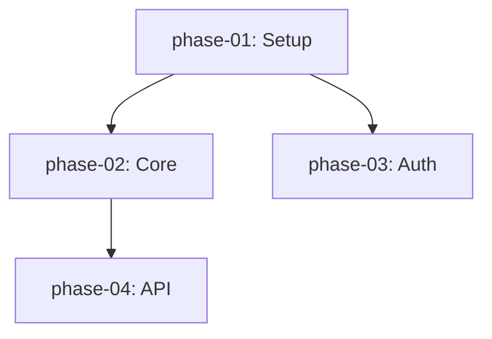

**Status: STAGED — ready for implementation.**

**Decision driver:** User requested in `scratch/discussion_features_next.md`: "could the implementation plan be divided into separate phase documents and an index which tracks the plan as a whole and the individual phases' status?"

### Problem

The current `plan/index.md` is a monolithic document. For large projects (60+ phases, 3000+ lines), this causes:
- **Token waste:** Do mode loads the entire plan even when only one phase is active
- **Git diff noise:** Editing one phase creates a diff across the whole file
- **No fine-grained locking:** A completed phase is locked in metadata but the document still shows it
- **Hard to navigate:** Humans and LLMs alike struggle to find the relevant section

### Solution

Split the monolithic plan into:

```
plan/
├── index.md          # Master index: metadata, dependency graph, status overview
├── phase-01.md       # Individual phase document
├── phase-02.md
├── phase-03.md
└── ...
```

#### 8.1 `index.md` format

```markdown
# Plan Index: {plan_id}

**Created:** 2026-05-20  
**Last updated:** 2026-05-24  
**Current phase:** phase-02  
**Overall status:** 2 / 8 phases implemented

## Dependency Graph



## Phase Status Table

| Phase | Title | Status | Locked |
|-------|-------|--------|--------|
| [phase-01](phase-01.md) | Project Setup | implemented | ✅ |
| [phase-02](phase-02.md) | Core Engine | under_review | ❌ |
| [phase-03](phase-03.md) | Authentication | pending | ❌ |
```

#### 8.2 `phase-XX.md` format

Each phase is a standalone markdown file with frontmatter:

```markdown
---
phase_id: phase-02
title: Core Engine
status: under_review
locked: false
dependencies:
  - phase-01
files_involved:
  - src/core/engine.py
  - src/core/config.py
---

# Phase 02: Core Engine

## Description
...

## Acceptance Criteria
- [ ] ...

## Completion Criteria
- [ ] ...

## Risks
- ...

## Known
- ...

## Unknown
- ...
```

#### 8.3 Backward compatibility

The existing `plan/index.md` is still supported — `parse_plan_file()` detects whether the path is a single file or a directory. If it's a directory, it reads `index.md` + the requested phase file.

```python
def parse_plan_file(path: Path) -> Plan:
    if path.is_dir():
        return _parse_plan_directory(path)
    return _parse_plan_single_file(path)
```

### Implementation

#### 8.1 Update `src/kimi_cli/plan/parser.py`

Add `_parse_plan_directory()`:
1. Read `index.md` for metadata and phase list
2. Read individual `phase-XX.md` files on demand
3. Parse YAML frontmatter into `Phase` objects
4. Cache parsed phases to avoid re-reading

#### 8.2 Update `src/kimi_cli/plan/models.py`

Add `PlanDirectory` model:
```python
class PlanDirectory(BaseModel):
    """A plan split into per-phase documents."""
    index_path: Path
    metadata: PlanMetadata
    phases: list[Phase]
    
    def get_phase_file(self, phase_id: str) -> Path:
        return self.index_path.parent / f"{phase_id}.md"
```

#### 8.3 Update `DoSession._load_plan_context()`

When `--phase` is specified:
1. Load `index.md` for dependency graph and status overview
2. Load only the target `phase-XX.md`
3. Inject both into context (index is lightweight, phase is detailed)

This reduces token usage from ~3000 lines to ~200 lines for large plans.

#### 8.4 Update `src/kimi_cli/plan/validator.py`

Validate that:
- Every phase listed in index has a corresponding `.md` file
- Every dependency references a phase that exists in the index
- No circular dependencies in the dependency graph

#### 8.5 Add `/split-plan` slash command (Think mode)

Converts a monolithic `plan.md` into the directory format:
```python
@think_registry.command
async def split_plan(history, session, args):
    """Split monolithic plan.md into per-phase documents."""
```

### Testing Requirements

| Test | Description |
|------|-------------|
| `test_parse_plan_directory` | Directory with index + phase files parses correctly |
| `test_parse_plan_directory_missing_phase` | Validator flags missing phase file |
| `test_parse_plan_directory_circular_dep` | Validator flags circular dependency |
| `test_load_plan_context_only_target_phase` | Do injects only target phase + index |
| `test_split_plan_command` | Monolithic plan splits into directory format |
| `test_backward_compat_single_file` | Single `plan.md` still works |

**Estimated effort:** 3-4 days.

---
