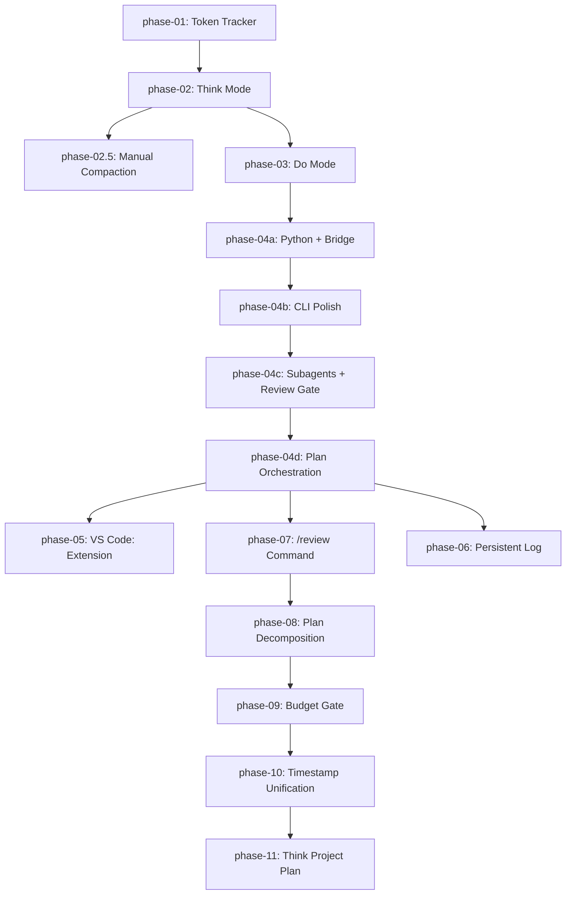

# Plan: Kimi-CLI Extensible Fork

Phased implementation of strategic features on top of the MoonshotAI/kimi-cli upstream.

## Phase Status Table

| Phase | Title | Status | Locked |
|-------|-------|--------|--------|
| [phase-01](phase-01.md) | Token Tracker | implemented | ✅ |
| [phase-02](phase-02.md) | Think Mode | implemented | ✅ |
| [phase-02-5](phase-02-5.md) | Think Mode Manual Compaction | implemented | ✅ |
| [phase-03](phase-03.md) | Do Mode — Git Snapshotting, Change Journal & Web API | implemented | ✅ |
| [phase-04a](phase-04a.md) | Think — Python Execution & Bridge | implemented | ✅ |
| [phase-04b](phase-04b.md) | CLI Polish & Integration | implemented | ✅ |
| [phase-04c](phase-04c.md) | Think Subagents & Do Plan Review Gate | implemented | ✅ |
| [phase-04d](phase-04d.md) | Plan-Driven Think/Do Orchestration & External Memory | implemented | ✅ |
| [phase-06](phase-06.md) | Persistent Log Architecture (PENDING) | pending | ❌ |
| [phase-05](phase-05.md) | VS Code: Extension — Dual-Tab UI | pending | ❌ |
| [phase-07](phase-07.md) | `/review` Slash Command in Do Mode | implemented | ✅ |
| [phase-08](phase-08.md) | Plan Decomposition (Per-Documents + Index) | implemented | ✅ |
| [phase-09](phase-09.md) | Budget Gate (Subagent Limits) | implemented | ✅ |
| [phase-10](phase-10.md) | Timestamp Format Unification | implemented | ✅ |
| [phase-11](phase-11.md) | Think Project Plan Command + Plan-Centric Handoff | staged | ❌ |

## Dependency Graph

## Decisions

| ADR | Title | Status | Date |
|-----|-------|--------|------|
| 001 | Decomposed plan format over monolithic | accepted | 2026-05-24 |
| 002 | Unix float timestamps over ISO 8601 strings | accepted | 2026-05-29 |
| 003 | Plan-centric handoff over conversation outbox | accepted | 2026-05-29 |

## Findings

| Finding | Title | Related Phases |
|---------|-------|----------------|
| 001 | Token tracking can be done via kosong StepResult | phase-01 |
| 002 | Think/Do dichotomy requires explicit handoff, not auto-merge | phase-04a, phase-11 |

## Notes

- **Deferred Features** section from the monolithic plan is not a phase; it lives below.
- **Open Questions** are tracked at the bottom of this index and should be reviewed before starting any pending phase.

---

## Deferred Features

The following features are **explicitly deferred** based on user discussion in `scratch/discussion_features_next.md`:

### Reverse Bridge (`/push-to-think`)

**Why deferred:** User wants it as an opt-in feature (`auto_push_to_think = false` default), not automatic. Concerned it breaks the Think/Do dichotomy. Will revisit after plan decomposition and budget gate are stable.

**When to revisit:** After Phase 9. Implement as a config option under `[bridge]` section.

### `/investigate` — Parallel Background Subagents

**Why deferred:** User wants to examine the existing upstream subagent run architecture first before designing a custom protocol. The upstream `kimi-cli` already has background task infrastructure (`BackgroundTaskManager`) that may be reusable.

**When to revisit:** After examining upstream background task code and Phase 9 budget gate (which provides the limit infrastructure needed for investigate tasks).

### E2E Integration Test

**Why deferred:** Complex mock infrastructure needed. User suggested exploring Ollama for lightweight local LLM testing instead of full mocking.

**When to revisit:** After Phase 9. Consider using Ollama with a small model (e.g., qwen2.5:3b) for deterministic, fast E2E tests.

### Budget Display in Dollars

**Why deferred:** User explicitly deferred dollar conversion. Requires model pricing tables and user configuration. Token-based limits are sufficient for now.

**When to revisit:** Phase 5 (Extension UI) when real-time quota display is implemented.

### Kimi Code Platform Quota Overlay

**Why deferred:** Requires UI work to display weekly/5-hour quota. The `(slash)usage` command already exists for platform-specific queries.

**When to revisit:** Phase 5 (Extension UI).

---

## Updated Open Questions for Future Resolution

1. **Pre-edit baseline capture:** RESOLVED in Phase 3.

2. **Binary files:** RESOLVED in Phase 4b.

3. **Journal retention:** RESOLVED in Phase 4b.

4. **Concurrent sessions:** If multiple Do sessions run concurrently, their git stashes may conflict. This is unlikely for a single-user CLI but worth documenting.

5. **Think Python sandbox on Windows:** `sandboxed` level falls back to `restricted` on non-macOS. A Windows-specific sandbox (Job Object, AppContainer) could be added later.

6. **Do mode resumption after push:** RESOLVED in Phase 11. Think `/push-to-do` writes a dispatch signal; Do does NOT auto-execute. The user must explicitly run `kimi --do --plan-file plan/index.md --phase {id}`. This is by design — the plan is the handoff artifact, not conversation history.

7. **Plan decomposition migration:** RESOLVED in Phase 8 (`/split-plan`) and Phase 11 (`/plan init`). Monolithic plans can be split interactively, and new plans are created directly in decomposed format. Migration guide: run `/split-plan` on any existing `plan.md`, then `/plan init` for new projects.

8. **Budget gate scope expansion:** Should budget limits also apply to the main agent loop (not just subagents)? User specifically requested subagent-only for now, but this could be expanded later.

9. **Reverse bridge UX:** When implemented, should the user be prompted "Push findings back to Think? [Y/n]" or should it be fully automatic when enabled? User prefers explicit opt-in.

10. **Investigate task result format:** Should investigation results be injected as a single assistant message, or as a structured system context block? Decision deferred until `/investigate` design phase.

11. **Plan synthesis quality:** LLM-generated plans may be incomplete or have incorrect dependencies. Should we add a `/plan review` subcommand (distinct from Do-mode audit) where Think mode validates the synthesized plan before `/push-to-do`? Consider adding this to Phase 11 or as a Phase 11.5 enhancement.

12. **Dispatch file format:** Phase 11 specifies `~/.kimi/dispatch.json` as the handoff mechanism. Should this use a more structured format (e.g., SQLite table or a queue directory) to support multiple pending dispatches? For now, single-file dispatch is sufficient; scale later if needed.

13. **ADR versioning:** ADRs have `supersedes`/`superseded_by` fields. Should `/plan update` automatically chain ADRs when a decision changes, or is manual creation sufficient? Manual is simpler; automation can be added later.

14. **Plan index auto-sync:** Should the `PlanDirectory` model cache its in-memory state, or always re-read from disk? Phase 11 assumes re-read on every access for simplicity, but a cache with invalidation may be needed if the CLI grows a GUI.

15. **Outbox deprecation timeline:** Phase 11 deprecates `think_outbox/` but keeps it for backward compat. When is it safe to remove? Proposed: Phase 13 (after two full releases of deprecation warnings).