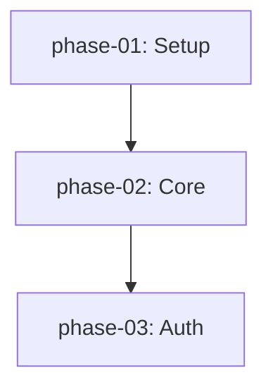

**Status: STAGED — 4/5 blockers resolved, Blocker 3 (synthesis validation) remains open.**

**Blockers review:** `scratch/reports/phase_11_blockers_review.md`

**Decision driver:** User identified that Think mode needs strategic project planning (distinct from upstream tactical plan mode). Also identified that `/push-to-do` should hand off the PLAN document, not conversation history.

### Problem

**Upstream plan mode** (`--plan` flag) is tactical: "What do I do in this session?" It writes a single `~/.kimi/plans/{slug}.md` and discards it after execution.

**Think mode needs strategic planning:** "What's the architecture and phased roadmap for this project?" The plan lives in the project repo (`plan/`), is edited across sessions, and guides Do mode implementation.

**Current handoff is wrong:** `/push-to-do` exports Think conversation messages to an outbox JSON. Do mode seeds its context from this conversation history. But Do doesn't need reasoning trails — it needs structured execution instructions.

**The plan document already contains:**
- Phases with descriptions, dependencies, acceptance criteria
- Decisions (via `related_decisions` frontmatter)
- Findings (via `related_findings` frontmatter)
- (Once timestamps are added) When things were decided

**Why push conversation history when the plan IS the handoff artifact?**

### Architectural decision: Plan-centric handoff

| Before (current) | After (Phase 11) |
|---|---|
| `/push-to-do` → writes conversation outbox JSON | `/push-to-do` → writes `dispatch.json` pointing to plan + phase |
| Do loads conversation messages as context | Do loads plan document as context |
| Think outbox (`~/.kimi/think_outbox/`) | Think outbox **deprecated** — removed in Phase 12 |
| `--seed-from-think {session_id}` | `--seed-from-think` **deprecated** — use `--plan-file` + `--phase` |

**New handoff flow:**
```
Think mode:
  /plan init → creates plan/index.md + phase files
  ... (research, refine)
  /push-to-do → writes ~/.kimi/dispatch.json
                  { plan_file: "plan/index.md",
                    target_phase: "phase-02",
                    action: "start_implement" }

Do mode:
  kimi --do --plan-file plan/index.md --phase phase-02
  → loads plan directly (no conversation history)
  → plan review gate audits phase-02
  → implements phase-02
  → writes plan/reports/completion-phase-02.md
  → updates plan/index.md: phase-02 status = implemented, locked = true
```

### Solution

#### 11.1 Default project docs layout

When `/plan init` runs, it scaffolds this structure in the project root:

```
docs/                      # Human-facing documentation (tracked)
├── AGENTS.md              # Agent guidance
├── BEST_PRACTICES.md      # Coding conventions
└── README.md              # Project overview

plan/                      # Operational plan documents (tracked)
├── index.md               # Plan overview, status table, dependency graph
├── phase-*.md             # Per-phase documents
├── decisions/
│   ├── index.md           # ADR master index
│   └── 001-*.md           # Individual ADRs
├── findings/              # Research outputs from Think mode
│   └── 001-*.md
└── reports/               # Do mode outputs (auto-generated, gitignored)
    ├── audit-phase-*.md
    └── completion-phase-*.md
```

**Rationale:** `docs/` is reserved for human-readable project documentation (manuals, guides, conventions). `plan/` contains machine-parseable operational data — Do mode reads `plan/index.md` at runtime, Think mode synthesizes phases into it, and slash commands mutate it. Keeping them separate prevents confusion between "docs you read" and "docs the CLI executes."

#### 11.2 Plan `index.md` format (formalized)

```markdown
---
plan_id: my-project
created: 2026-05-29
last_updated: 2026-05-29
current_phase: phase-02
overall_status: 1 / 3 implemented
---

# Plan: My Project

## Phase Status Table

| Phase | Title | Status | Locked | Last Updated |
|-------|-------|--------|--------|--------------|
| [phase-01](phase-01.md) | Setup | implemented | ✅ | 2026-05-29 |
| [phase-02](phase-02.md) | Core Engine | under_review | ❌ | 2026-05-29 |
| [phase-03](phase-03.md) | Auth | pending | ❌ | — |

## Dependency Graph



## Decisions

| ADR | Title | Status | Date |
|-----|-------|--------|------|
| [001](../decisions/001-use-postgresql.md) | Use PostgreSQL | accepted | 2026-05-29 |
```

The status table and decisions table are **machine-parseable** (Markdown tables), not freeform text. This enables `plan status` commands and UI rendering.

#### 11.3 Phase frontmatter extensions

```yaml
---
phase_id: phase-03
title: Authentication
status: pending
dependencies:
  - phase-01
files_involved:
  - src/auth/oauth2.py
related_findings:
  - findings/001-auth-comparison
related_decisions:
  - decisions/001-use-postgresql
---
```

`related_findings` and `related_decisions` create bidirectional traceability between phases, research, and architecture decisions.

#### 11.4 ADR format (`plan/decisions/001-*.md`)

```markdown
---
adr_id: 001
title: Use PostgreSQL over SQLite
status: accepted
date: 2026-05-29
supersedes: null
superseded_by: null
---

# ADR 001: Use PostgreSQL over SQLite

## Context
SQLite is simpler but doesn't handle concurrent writes well.

## Decision
Use PostgreSQL for all persistent storage.

## Consequences
- Need Docker Compose for local dev
- Better concurrency support
- More complex backups
```

`plan/decisions/index.md` is a master index with status table, similar to `plan/index.md`.

#### 11.5 Finding format (`plan/findings/001-*.md`)

```markdown
---
finding_id: 001
title: Auth Methods Comparison
date: 2026-05-29
related_phases:
  - phase-03
---

# Finding 001: Auth Methods Comparison

## Summary
JWT+JWE is required, not plain JWT.

## Evidence
- [RFC 7516](https://tools.ietf.org/html/rfc7516) — JSON Web Encryption
- Source: src/auth/research.md

## Impact
Affects Phase 3 encryption strategy.
```

#### 11.6 Think `/plan` command suite

```python
@think_registry.command(name="plan")
async def slash_plan(history, session, args):
    """Project plan management.
    
    /plan init [name]              # LLM synthesizes plan from conversation
    /plan status                   # Show plan + decisions + findings status
    /plan add-phase <title>        # Add empty phase, LLM fills from context
    /plan update <phase-id>        # Re-synthesize phase from conversation
    /plan add-decision <title>     # Create ADR from conversation
    /plan add-finding <title>      # Create finding from conversation
    """
```

**`/plan init`** — the key command:
1. Check if `plan/index.md` already exists → confirm overwrite
2. Format synthesis prompt from Think conversation history
3. Call ThinkSoul's own LLM (`_call_llm()` or `generate()`)
4. LLM outputs file blocks with `=== FILE: path ===` delimiters
5. Parse blocks, write files to `plan/`, `plan/decisions/`, `plan/findings/`
6. Update `docs/README.md` to include plan index link
7. Validate by re-parsing with `parse_plan_directory_from_path()`

**LLM prompt for synthesis:**
```markdown
You are a project planner. Based on the conversation below, synthesize a
phased implementation plan with architecture decisions and findings.

Conversation:
{{think_conversation}}

Output format:
Write the plan as decomposed markdown files using this delimiter format:

=== FILE: plan/index.md ===
---
plan_id: ...
---
...

=== FILE: plan/phase-01.md ===
---
title: ...
status: pending
---
...

Also create any necessary decisions in plan/decisions/ and findings in plan/findings/.
```

**Why Markdown delimiters, not JSON:**
- LLMs are trained extensively on Markdown; JSON output is unreliable
- The output IS the file content — no secondary rendering needed
- Kosong does not support `response_format` / JSON mode
- Parsing is simple regex: `r"=== FILE: (.+?) ===\n(.*?)\n(?=== FILE: |$)"`

**Error recovery:**
If parsing fails or validation finds errors, show the user the raw LLM output and ask them to fix it, or retry with a more constrained prompt.

#### 11.7 Plan-centric `/push-to-do` rework

**Current behavior (to be deprecated):**
```python
# think/push.py
export_to_outbox(session) → ~/.kimi/think_outbox/{session_id}.json
```

**New behavior:**
```python
# think/push.py (rewritten)
def push_plan_to_do(plan_file: Path, target_phase: str) -> Dispatch:
    """Write a dispatch signal pointing to the plan document."""
    if not plan_file.exists():
        raise RuntimeError(f"No plan found at {plan_file}. Use /plan init first.")
    
    return write_dispatch(
        plan_id=parse_plan_file(plan_file).metadata.plan_id,
        target_phase=target_phase,
        action=DispatchAction.START_IMPLEMENT,
    )
```

**Think slash command:**
```python
@think_registry.command(name="push-to-do")
def slash_push_to_do(history, session, args):
    plan_file = Path("plan/index.md")
    if not plan_file.exists():
        return "No plan found. Use /plan init first."
    
    target_phase = args.strip() or _infer_next_phase(plan_file)
    dispatch = push_plan_to_do(plan_file, target_phase)
    return (
        f"Dispatched plan to Do mode.\n"
        f"Target phase: {target_phase}\n"
        f"Run: kimi --do --plan-file {plan_file} --phase {target_phase}"
    )
```

**Do mode loading:**
```python
# app.py (simplified)
if seed_from_think:
    # DEPRECATED: load outbox messages
    logger.warning("--seed-from-think is deprecated. Use --plan-file instead.")
    # ... existing outbox loading (remove in Phase 12)

# Primary path: load plan directly
if plan_file:
    do_session = DoSession(..., plan_file=plan_file, phase=phase)
```

#### 11.8 Do mode auto-updates plan index on completion

When Do finishes implementing a phase:
1. Write `plan/reports/audit-{phase_id}.md` (if audit was performed)
2. Write `plan/reports/completion-{phase_id}.md`
3. Update `plan/index.md`:
   - Set phase status to `implemented`
   - Set `locked: true`
   - Update `last_updated`
   - Update `current_phase` to next pending phase
   - Update `overall_status`

This keeps the plan index as the single source of truth for project status.

### Implementation

#### 11.1 Think command module

Create `src/kimi_cli/think/plan_commands.py`:
- `slash_plan_init()` — plan synthesis
- `slash_plan_status()` — parse and display plan status
- `slash_plan_add_phase()` — add phase
- `slash_plan_update()` — update phase
- `slash_plan_add_decision()` — create ADR
- `slash_plan_add_finding()` — create finding

#### 11.2 Plan synthesis parser

Create `src/kimi_cli/think/plan_synthesis.py`:
- `synthesize_plan_from_conversation(messages) -> str` — formats LLM prompt
- `parse_file_delimiters(text) -> dict[str, str]` — parses `=== FILE: ===` blocks
- `write_plan_files(files: dict, work_dir: Path)` — writes to disk

#### 11.3 ADR and finding templates

Create `src/kimi_cli/plan/adr.py` and `src/kimi_cli/plan/finding.py`:
- `render_adr()` / `render_finding()` — Markdown templates
- `parse_adr()` / `parse_finding()` — for validation and indexing

#### 11.4 Update `think/push.py`

Replace outbox-based export with plan-dispatch:
- `push_plan_to_do(plan_file, target_phase) -> Dispatch`
- Deprecate `export_to_outbox()` (keep for backward compat, log warning)

#### 11.5 Update `app.py`

- Add deprecation warning for `--seed-from-think`
- Ensure `--plan-file` + `--phase` is the primary path

#### 11.6 Update `do/session.py`

- Add plan index auto-update after phase completion
- Write completion reports to `plan/reports/`

#### 11.7 Add `/complete` slash command (Do mode)

**Blocker 1 resolution:** Do mode needs an explicit "finish implementing" signal. Users exit via `/exit` or Ctrl+C; there is no implicit completion detection.

**`src/kimi_cli/soul/slash.py` (Do-mode slash commands):**
```python
@registry.command
async def complete(soul: KimiSoul, args: str):
    """Mark the current phase as complete.
    
    Writes a completion report and updates the plan index.
    Usage: /complete [notes]
    """
    from kimi_cli.do.session import DoSession
    
    # Find the DoSession attached to this soul (if any)
    do_session = _find_do_session_for_soul(soul)
    if do_session is None:
        wire_send(TextPart(text="No active Do session. /complete only works in Do mode."))
        return
    
    if do_session._phase is None:
        wire_send(TextPart(text="No target phase set. Run with --phase."))
        return
    
    phase_id = do_session._phase
    plan_file = do_session._plan_file
    notes = args.strip()
    
    # 1. Write completion report
    report_path = _write_completion_report(plan_file, phase_id, soul, notes)
    
    # 2. Update plan index
    _update_plan_index_status(plan_file, phase_id, status="implemented", locked=True)
    
    # 3. Store signal in journal
    if do_session.journal is not None:
        do_session.journal.append({
            "type": "phase_complete",
            "phase_id": phase_id,
            "report_path": str(report_path),
            "timestamp": time.time(),
        })
    
    wire_send(TextPart(
        text=f"Phase {phase_id} marked complete.\n"
             f"Report: {report_path}\n"
             f"Plan index updated."
    ))


def _find_do_session_for_soul(soul: KimiSoul) -> DoSession | None:
    """Weak-ref lookup or registry — DoSession holds a reference to soul."""
    # Option A: Maintain a weak-value dict in DoSession class
    return DoSession._active_sessions.get(id(soul))


def _write_completion_report(
    plan_file: Path | None,
    phase_id: str,
    soul: KimiSoul,
    notes: str,
) -> Path:
    work_dir = soul._runtime.work_dir
    reports_dir = work_dir / "plan" / "reports"
    reports_dir.mkdir(parents=True, exist_ok=True)
    
    report_path = reports_dir / f"completion-{phase_id}.md"
    
    # Gather journal summary
    changes_summary = "(journal not available)"
    # ... extract from ChangeJournal if attached
    
    content = f"""---
phase_id: {phase_id}
completed_at: {datetime.now(timezone.utc).isoformat()}
---

# Completion Report: {phase_id}

## Summary
{notes or "(no notes provided)"}

## Changes
{changes_summary}

## Verification
- [ ] Acceptance criteria met
- [ ] Tests pass
- [ ] Code reviewed
"""
    report_path.write_text(content, encoding="utf-8")
    return report_path


def _update_plan_index_status(
    plan_file: Path | None,
    phase_id: str,
    status: str,
    locked: bool,
) -> None:
    if plan_file is None:
        return
    index_file = plan_file if plan_file.name == "index.md" else plan_file.parent / "index.md"
    if not index_file.exists():
        return
    
    text = index_file.read_text(encoding="utf-8")
    # Update the status table row for this phase
    # Regex: find | [phase_id] | ... | old_status | ... |
    pattern = rf"(\| \[?{phase_id}\]? \| .*? \| )\w+( \| .+? \|)"
    replacement = rf"\g<1>{status}\g<2>"
    text = re.sub(pattern, replacement, text)
    index_file.write_text(text, encoding="utf-8")
```

**Registration:** Add `complete` to the Do-mode slash command registry. If Do mode uses a separate registry from Think mode, register there instead.

**Edge cases:**
- `/complete` in Think mode → error message
- `/complete` with no `--phase` → error message  
- Plan file not found → write report locally, skip index update

#### 11.8 Update `Dispatch` model

**Blocker 2 resolution:** `Dispatch` needs a `plan_file` field. Do mode cannot resolve a plan from `plan_id` alone without scanning the filesystem.

**`src/kimi_cli/plan/models.py`:**
```python
class Dispatch(BaseModel):
    dispatch_id: str
    plan_id: str
    plan_file: str | None = None   # ← NEW: absolute or relative path to plan index
    action: DispatchAction
    target_phase: str
    dispatched_at: float = Field(default_factory=lambda: __import__("time").time())
    dispatched_by: Literal["think", "user", "afk_auto"] = "think"
    require_user_approval: bool = True
    afk_mode: bool = False
```

**`src/kimi_cli/plan/dispatch.py`:**
```python
def write_dispatch(
    plan_id: str,
    target_phase: str,
    plan_file: str | None = None,   # ← NEW
    action: DispatchAction = None,
    ...
) -> Dispatch:
    dispatch = Dispatch(
        dispatch_id=f"disp_{time.time():.0f}_{uuid.uuid4().hex[:6]}",
        plan_id=plan_id,
        plan_file=plan_file,        # ← NEW
        ...
    )
    ...

def read_dispatch(path: Path | None = None) -> Dispatch | None:
    ...
    try:
        data = json.loads(path.read_text(encoding="utf-8"))
        dispatch = Dispatch.model_validate(data)
        if dispatch.plan_file and not Path(dispatch.plan_file).exists():
            raise FileNotFoundError(f"Plan file not found: {dispatch.plan_file}")
        return dispatch
    except (json.JSONDecodeError, Exception):
        ...
```

**Do mode loading (`app.py`):**
```python
if seed_from_think:
    logger.warning("--seed-from-think is deprecated. Use --plan-file instead.")
    # ... existing fallback loading

# Primary path: load from dispatch or explicit args
plan_file = plan_file or (dispatch.plan_file if dispatch else None)
```

#### 11.9 Synthesis validation rules

**Blocker 3 resolution:** LLM synthesis format needs concrete validation.

| Rule | Enforcement |
|------|-------------|
| Path must start with `plan/` | Reject any file outside project plan directory |
| Frontmatter must parse with YAML | Validate each file before writing |
| Index.md must exist in output | Require at least one `index.md` |
| File count matches expected phases | Warn if fewer files than expected |
| Retry with constrained prompt | On parse failure, retry with stronger instructions |

**Alternative (recommended):** Generate files incrementally instead of single-shot:
1. First call: synthesize `index.md` only
2. Second call: synthesize phase files one at a time
This stays within token limits and reduces format deviation risk.

#### 11.10 Deprecation timeline

**Blocker 4 resolution:** Explicit timeline for `--seed-from-think`.

| Phase | Behavior |
|-------|----------|
| Phase 11 | `--seed-from-think` works with deprecation warning |
| Phase 12 | `--seed-from-think` removed entirely |

**`src/kimi_cli/app.py`:**
```python
if seed_from_think:
    logger.warning(
        "--seed-from-think is deprecated and will be removed in a future release. "
        "Use --plan-file with --phase instead."
    )
    seed_messages = load_outbox(seed_from_think)
    ...
```

**`src/kimi_cli/think/push.py` — updated `/push-to-do` output:**
```python
def slash_push_to_do(history, session, args):
    ...
    return (
        f"Dispatched plan to Do mode.\n"
        f"Target phase: {target_phase}\n"
        f"Run: kimi --do --plan-file {plan_file} --phase {target_phase}\n"
        f"(Deprecated: --seed-from-think will be removed in a future release)"
    )
```

**`src/kimi_cli/cli/__init__.py`:** Add `deprecated=True` to `--seed-from-think` Typer option (if supported), or document in `--help` text.

#### 11.11 Overwrite behavior for `/plan init`

**Blocker 5 resolution:** Slash commands cannot prompt for confirmation. Think REPL commands return `str`, not interactive dialogs.

**`src/kimi_cli/think/plan_commands.py`:**
```python
def _backup_existing_plan(plan_file: Path) -> Path:
    timestamp = datetime.now(timezone.utc).strftime("%Y%m%d_%H%M%S")
    backup_path = plan_file.parent / f"{plan_file.name}.backup.{timestamp}"
    plan_file.rename(backup_path)
    return backup_path

@think_registry.command(name="plan")
async def slash_plan(history, session, args):
    """/plan init [name] [--force] ..."""
    parts = args.strip().split()
    subcommand = parts[0] if parts else ""
    force = "--force" in parts
    ...
    if subcommand == "init":
        plan_file = Path("plan/index.md")
        if plan_file.exists() and not force:
            # Auto-backup by default
            backup = _backup_existing_plan(plan_file)
            # Also backup phase files
            for phase_file in plan_file.parent.glob("phase-*.md"):
                _backup_existing_plan(phase_file)
            msg = f"Existing plan backed up to {backup}. Use --force to skip backup."
        ...
```

**Behavior:**
| Situation | Action |
|-----------|--------|
| Plan exists, no `--force` | Auto-backup all `plan/*.md` files, then overwrite |
| Plan exists, `--force` | Overwrite without backup |
| Plan does not exist | Create normally |

#### 11.12 Directory scaffolding

**Gap A resolution:** `/plan init` must create directories.

Ensure `mkdir -p` for:
- `plan/`
- `plan/decisions/`
- `plan/findings/`
- `plan/reports/`

### Testing Requirements

| Test | Description |
|------|-------------|
| `test_plan_init_creates_index_and_phases` | `/plan init` writes correct structure |
| `test_plan_init_synthesis_prompt_format` | Prompt includes conversation history |
| `test_plan_init_parses_file_delimiters` | `=== FILE: ===` blocks parsed correctly |
| `test_plan_status_shows_table` | Status command renders readable table |
| `test_push_to_do_requires_plan` | Error if no plan exists |
| `test_push_to_do_writes_dispatch` | Dispatch.json written with correct phase |
| `test_adr_render_and_parse` | ADR roundtrip: render → write → parse |
| `test_finding_render_and_parse` | Finding roundtrip |
| `test_do_updates_plan_index_on_complete` | Phase status updated after Do completion |
| `test_backward_compat_outbox` | Old outbox still loads with deprecation warning |
| `test_complete_command_writes_report` | `/complete` writes completion report and updates index |
| `test_dispatch_plan_file_field` | Dispatch roundtrip with `plan_file` |
| `test_plan_init_auto_backup` | Existing plan backed up before overwrite |
| `test_plan_init_force_overwrite` | `--force` skips backup |
| `test_synthesis_validation_rejects_bad_path` | Path traversal rejected |
| `test_synthesis_validation_requires_index` | Missing index.md fails validation |

**Estimated effort:** 3–4 days (will extend to 4–5 days with blocker resolutions).

---

